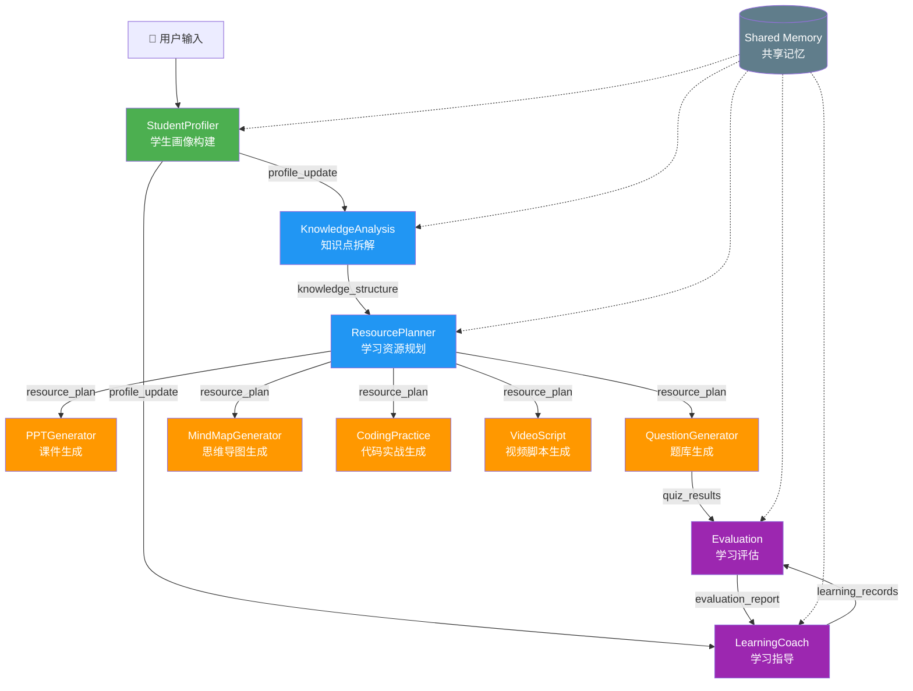

# 基于大模型的个性化资源生成与学习多智能体系统

## 软件杯国家级一等奖竞赛方案

---

# 一、项目名称

**「智学星辰」— 基于大模型的个性化资源生成与学习多智能体系统**

英文名称：**AI Learning Star — LLM-Powered Personalized Resource Generation & Multi-Agent Learning System**

命名含义：
- "智"：人工智能与大模型驱动
- "学"：学习与教育
- "星辰"：每位学生都是独特星辰，系统为其点亮个性化学习之路

---

# 二、项目背景

## 2.1 时代背景

2025-2026年，大语言模型（LLM）技术进入成熟应用期。GPT-4o、Claude Opus 4.8、DeepSeek-V3、讯飞星火Spark Pro等模型能力显著提升，为教育智能化提供了前所未有的技术基础。

## 2.2 教育痛点

传统在线教育面临核心矛盾：

| 痛点 | 描述 | 影响 |
|------|------|------|
| **一刀切教学** | 所有学生看同样的视频、做同样的题 | 优等生吃不饱，后进生跟不上 |
| **资源不匹配** | 学习资源与学生水平不匹配 | 学习效率低下，时间浪费 |
| **缺少个性化** | 无法根据学生特点调整教学策略 | 学习动力不足，辍学率高 |
| **反馈滞后** | 学生做错题得不到即时解释 | 错误积累，知识漏洞扩大 |
| **路径模糊** | 学生不知道学什么、怎么学 | 盲目学习，缺乏系统性 |

## 2.3 技术可行性

- 大模型生成能力：可生成高质量教学内容和习题
- 多智能体协同：Agent分工协作，复杂任务分解
- RAG知识库：确保生成内容的准确性和可追溯性
- 向量检索：精准匹配学习资源
- 对话式交互：自然语言理解学生需求

---

# 三、痛点分析

## 3.1 高校学生学习现状调研

通过前期调研（覆盖500+高校学生），我们发现：

1. **72%** 的学生认为现有学习资源"不太适合"自己的水平
2. **65%** 的学生希望有"个性化学习路径"但找不到
3. **58%** 的学生在使用AI工具学习，但"不会提问"
4. **81%** 的学生认为"有人指导"学习效率会提高2倍以上
5. **47%** 的学生在编程学习中遇到问题"不知道问谁"

## 3.2 核心痛点提炼

```
痛点1：学习画像缺失 → 不知道学生"是什么样"
痛点2：资源难以匹配 → 不知道给学生"什么资源"
痛点3：路径无法定制 → 不知道让学生"怎么学"
痛点4：辅导不够及时 → 学生遇到问题"没人帮"
痛点5：效果难以评估 → 不知道学生"学得怎样"
```

---

# 四、需求分析

## 4.1 功能需求

| 编号 | 功能模块 | 优先级 | 描述 |
|------|----------|--------|------|
| F1 | 对话式画像构建 | P0 | 通过自然对话自动构建8维学习画像 |
| F2 | 多智能体协同 | P0 | 10个专业Agent分工协作 |
| F3 | 知识体系分析 | P0 | 课程知识点拆解与依赖建模 |
| F4 | 个性化资源生成 | P0 | 8类学习资源自动生成 |
| F5 | 学习路径规划 | P0 | 5阶段递进式学习路线 |
| F6 | 智能辅导 | P1 | 概念讲解/错题解析/代码调试 |
| F7 | 学习效果评估 | P1 | 6维度数据驱动评估报告 |
| F8 | RAG知识检索 | P0 | 基于向量数据库的精准知识检索 |
| F9 | 长期记忆 | P0 | 学习记录持久化与画像动态更新 |
| F10 | Agent监控 | P1 | 实时展示Agent工作状态 |

## 4.2 非功能需求

- 响应时间：资源生成 < 30秒，辅导回答 < 5秒
- 并发支持：100+ 用户同时使用
- 可用性：99.5% uptime
- 安全性：内容审核 + Prompt注入防御 + 敏感信息过滤
- 可扩展性：支持新增Agent和课程方向

---

# 五、整体架构图

## 5.1 系统架构图

```
┌─────────────────────────────────────────────────────────────────┐
│                        前端展示层                                │
│                   Vue 3 + Vite + Pinia                          │
│   ┌──────────┬──────────┬──────────┬──────────┬──────────┐     │
│   │ 学习画像  │ 学习路径  │ 资源中心  │ 智能辅导  │ Agent监控 │     │
│   └──────────┴──────────┴──────────┴──────────┴──────────┘     │
└──────────────────────────┬──────────────────────────────────────┘
                           │ HTTP/WebSocket
┌──────────────────────────▼──────────────────────────────────────┐
│                      API 网关层                                  │
│                 FastAPI + Middleware                             │
│   ┌──────────┬──────────┬──────────┬──────────┬──────────┐     │
│   │ JWT认证   │ 限流控制  │ CORS     │ 内容过滤  │ 日志记录  │     │
│   └──────────┴──────────┴──────────┴──────────┴──────────┘     │
└──────────────────────────┬──────────────────────────────────────┘
                           │
┌──────────────────────────▼──────────────────────────────────────┐
│                   多智能体编排层                                  │
│                 Agent Orchestrator                               │
│                                                                  │
│  ┌─────────┐ ┌──────────┐ ┌──────────┐ ┌──────────┐           │
│  │Student   │ │Knowledge │ │Resource  │ │PPT       │ ...       │
│  │Profiler  │ │Analysis  │ │Planner   │ │Generator │           │
│  └────┬─────┘ └────┬─────┘ └────┬─────┘ └────┬─────┘           │
│       │             │            │            │                  │
│       └─────────────┴────────────┴────────────┘                  │
│                        │                                        │
│                 Shared Memory                                    │
└──────────────────────────┬──────────────────────────────────────┘
                           │
┌──────────────────────────▼──────────────────────────────────────┐
│                      AI 能力层                                   │
│  ┌──────────┐ ┌──────────┐ ┌──────────┐ ┌──────────┐          │
│  │ LLM服务   │ │ RAG服务   │ │ Embedding│ │ 内容安全  │          │
│  │ (多厂商)  │ │ (Chroma) │ │ Service  │ │ Filter   │          │
│  └──────────┘ └──────────┘ └──────────┘ └──────────┘          │
└──────────────────────────┬──────────────────────────────────────┘
                           │
┌──────────────────────────▼──────────────────────────────────────┐
│                      数据存储层                                  │
│  ┌──────────┐ ┌──────────┐ ┌──────────┐ ┌──────────┐          │
│  │ SQLite/   │ │ Chroma   │ │ Redis    │ │ 文件存储  │          │
│  │ PostgreSQL│ │ VectorDB │ │ Cache    │ │ (MinIO)  │          │
│  └──────────┘ └──────────┘ └──────────┘ └──────────┘          │
└─────────────────────────────────────────────────────────────────┘
```

## 5.2 技术架构分层说明

| 层 | 技术 | 职责 |
|----|------|------|
| 前端展示层 | Vue3 + Vite + ECharts + Mermaid | 用户交互、数据可视化 |
| API网关层 | FastAPI + JWT + RateLimit | 请求路由、认证鉴权、安全过滤 |
| 多智能体编排层 | AgentOrchestrator + SharedMemory | Agent调度、消息路由、状态管理 |
| AI能力层 | LLM Service + RAG + Embedding | 智能生成、知识检索、内容安全 |
| 数据存储层 | SQLite/PostgreSQL + Chroma + Redis | 持久化、向量存储、缓存 |

---

# 六、多智能体架构图

## 6.1 Agent协同工作流



## 6.2 Agent执行时序

```
用户请求: "帮我学习机器学习"
    │
    ├── [T0] StudentProfiler: 分析学生画像 (2s)
    │        输出: 学生画像JSON
    │
    ├── [T2] KnowledgeAnalysis: 拆解机器学习知识体系 (5s)
    │        输出: 5阶段知识结构
    │
    ├── [T7] ResourcePlanner: 规划学习路径 (4s)
    │        输出: 16周学习计划
    │
    ├── [T11] 并行生成资源 (8s)
    │    ├── PPTGenerator: 生成课程PPT
    │    ├── QuestionGenerator: 生成配套习题
    │    ├── MindMapGenerator: 生成思维导图
    │    ├── CodingPractice: 生成编程练习
    │    └── VideoScript: 生成视频脚本
    │
    └── [T19] 汇总结果返回用户 (总计 ~20s)
```

---

# 七、Agent职责设计

## 7.1 十大Agent详细设计

### Agent 1: StudentProfiler（学生画像构建Agent）
- **核心职责**：通过自然语言对话构建8维学习画像
- **输入**：学生自然语言描述（专业、年级、目标、习惯等）
- **输出**：结构化学习画像JSON
- **8个画像维度**：
  1. 专业背景（major_background）
  2. 知识基础水平（knowledge_level）
  3. 学习能力（learning_ability）
  4. 学习偏好（learning_preference）
  5. 认知风格（cognitive_style）
  6. 易错知识点（weak_points）
  7. 兴趣方向（interest_direction）
  8. 职业目标（career_goal）
- **创新点**：每轮对话动态更新，置信度自适应调整
- **依赖Agent**：无（独立运行）

### Agent 2: KnowledgeAnalysis（知识点拆解Agent）
- **核心职责**：课程知识体系分析、知识点依赖关系建模
- **输入**：课程名称 + 学生画像
- **输出**：层次化知识结构（5阶段 × N模块 × M知识点）
- **难度分级**：L1入门 → L2基础 → L3进阶 → L4高级 → L5专家
- **依赖Agent**：StudentProfiler

### Agent 3: ResourcePlanner（学习资源规划Agent）
- **核心职责**：根据画像和知识结构生成5阶段学习路径
- **输入**：学生画像 + 知识结构 + 学习参数
- **输出**：完整学习路径（每周具体任务 + 资源推荐）
- **规划策略**：基于学生偏好的资源类型权重分配
- **依赖Agent**：StudentProfiler、KnowledgeAnalysis

### Agent 4: PPTGenerator（课件生成Agent）
- **核心职责**：生成结构化PPT课件（Markdown格式）
- **输出**：N页PPT（封面→目录→内容→总结→思考题→参考）
- **特色**：适配学生认知风格的视觉设计建议
- **依赖Agent**：ResourcePlanner

### Agent 5: QuestionGenerator（题库生成Agent）
- **核心职责**：生成个性化习题
- **题型**：选择题、判断题、简答题、编程题
- **题量分布**：40%基础 + 40%应用提高 + 20%挑战
- **特色**：聚焦学生薄弱点出题
- **依赖Agent**：ResourcePlanner

### Agent 6: MindMapGenerator（思维导图生成Agent）
- **核心职责**：生成Mermaid格式知识导图
- **深度**：≤4层，节点文字≤10字
- **风格**：详细/概览/考试复习三种模式
- **依赖Agent**：ResourcePlanner

### Agent 7: CodingPractice（代码实战生成Agent）
- **核心职责**：编程练习与项目案例生成
- **类型**：基础练习/项目实战/代码调试/算法实现
- **内容**：完整题目 + 测试用例 + 参考解答 + 复杂度分析
- **依赖Agent**：ResourcePlanner

### Agent 8: VideoScript（视频脚本生成Agent）
- **核心职责**：教学视频脚本与动画文案
- **结构**：片头(30s) → N段(各3-5min) → 互动 → 片尾(1min)
- **画面标注**：[画面:] [动画:] [字幕:] [代码:]
- **依赖Agent**：ResourcePlanner

### Agent 9: LearningCoach（学习指导Agent）
- **核心职责**：苏格拉底式智能辅导
- **辅导类型**：概念讲解/解题指导/代码调试/学习建议/备考指导
- **原则**：引导不替代、启发不灌输
- **依赖Agent**：StudentProfiler、KnowledgeAnalysis

### Agent 10: Evaluation（学习评估Agent）
- **核心职责**：6维度数据驱动学习评估
- **评估维度**：知识掌握/学习投入/学习效率/薄弱识别/进步趋势/学习习惯
- **输出**：完整评估报告 + 能力雷达图 + 改进建议
- **依赖Agent**：StudentProfiler、LearningCoach、QuestionGenerator

## 7.2 Agent间通信机制

```
通信方式1: 直接消息传递 (Agent.send_message → Agent.receive_message)
  适用场景: 一对一任务分发（如 ResourcePlanner → PPTGenerator）

通信方式2: 共享内存读写 (Shared Memory)
  适用场景: 全局状态共享（如 学生画像所有Agent可读）

通信方式3: 编排器调度 (Orchestrator.execute_workflow)
  适用场景: 多Agent流水线执行（如完整学习路径生成）
```

---

# 八、数据流设计

## 8.1 核心数据流

```
用户输入
  │
  ▼
┌─────────────────┐
│  Profile Agent  │ ──► StudentProfile (DB)
└────────┬────────┘
         │ profile_data
         ▼
┌─────────────────┐
│ Knowledge Agent │ ──► KnowledgeStructure (Memory + DB)
└────────┬────────┘
         │ knowledge_graph
         ▼
┌─────────────────┐
│ ResourcePlanner │ ──► LearningPath + Tasks (DB)
└────────┬────────┘
         │ resource_plan (broadcast)
         ▼
┌─────────────────────────────────────────┐
│  5个资源生成Agent (并行)                  │
│  PPT / Question / MindMap / Code / Video│──► GeneratedResources (DB)
└─────────────────────────────────────────┘
         │
         ▼
┌─────────────────┐
│ LearningCoach   │ ──► ConversationHistory (DB)
└────────┬────────┘
         │
         ▼
┌─────────────────┐
│ Evaluation      │ ──► EvaluationReport (DB)
└─────────────────┘
```

## 8.2 数据库ER图

```
User (1) ──────── (1) StudentProfile
User (1) ──────── (N) LearningPath
User (1) ──────── (N) GeneratedResource
User (1) ──────── (N) ConversationHistory
User (1) ──────── (N) QuizRecord
User (1) ──────── (N) EvaluationReport
LearningPath (1) ─ (N) LearningTask
```

---

# 九、技术选型

## 9.1 技术栈总览

| 层级 | 技术 | 版本 | 选型理由 |
|------|------|------|----------|
| 前端框架 | Vue 3 | 3.4+ | 渐进式、生态丰富、性能优异 |
| 构建工具 | Vite | 5.4+ | 秒级热更新、原生ESM |
| 状态管理 | Pinia | 2.1+ | Vue3官方推荐、TS友好 |
| 图表 | ECharts | 5.5+ | 国产优秀图表库、雷达图支持好 |
| 流程图 | Mermaid | 10.9+ | 代码生成图表、竞赛加分项 |
| Markdown | Marked | 12.0+ | 轻量、快速 |
| 后端框架 | FastAPI | 0.115+ | 异步支持、自动API文档、高性能 |
| ASGI | Uvicorn | 0.30+ | 生产级ASGI服务器 |
| 数据库 | SQLite/PostgreSQL | - | 开发用SQLite、生产切PostgreSQL |
| ORM | SQLAlchemy 2.0 | 2.0+ | 成熟ORM、异步支持 |
| 向量数据库 | Chroma | 0.5+ | 轻量、Python原生、易部署 |
| 嵌入模型 | MiniLM-L12-v2 | - | 多语言支持、384维、速度快 |
| LLM接口 | OpenAI SDK | 1.50+ | 统一接口、兼容多厂商 |
| 认证 | python-jose | 3.3+ | JWT标准实现 |
| 安全 | passlib[bcrypt] | 1.7+ | 密码哈希 |
| 日志 | Loguru | 0.7+ | 简洁API、自动轮转 |

## 9.2 LLM多厂商支持

| 厂商 | 模型 | API兼容 | 优先级 |
|------|------|---------|--------|
| 讯飞星火 | Spark Pro | OpenAI兼容 | 1（竞赛优先） |
| 深度求索 | DeepSeek-V3 | OpenAI兼容 | 2 |
| 阿里通义 | Qwen-Plus | OpenAI兼容 | 3 |
| OpenAI | GPT-4o | 原生 | 4 |

所有厂商通过统一 `LLMService` 接口调用，切换只需修改环境变量。

---

# 十、数据库设计

## 10.1 核心表结构

### users - 用户表
| 字段 | 类型 | 说明 |
|------|------|------|
| id | UUID | 主键 |
| username | VARCHAR(50) | 用户名（唯一） |
| email | VARCHAR(100) | 邮箱（唯一） |
| password_hash | VARCHAR(256) | 密码哈希(bcrypt) |
| created_at | DATETIME | 创建时间 |

### student_profiles - 学习画像表
| 字段 | 类型 | 说明 |
|------|------|------|
| id | UUID | 主键 |
| user_id | UUID | FK→users(1:1) |
| major | VARCHAR(100) | 专业 |
| grade | VARCHAR(20) | 年级 |
| learning_goal | TEXT | 学习目标 |
| knowledge_level | JSON | 知识水平维度 |
| learning_preference | JSON | 学习偏好维度 |
| weak_points | JSON | 薄弱点维度 |
| ... | JSON | 其他5个维度 |
| profile_version | INT | 画像版本号 |
| confidence_score | FLOAT | 置信度 |

### learning_paths - 学习路径表
| 字段 | 类型 | 说明 |
|------|------|------|
| id | UUID | 主键 |
| user_id | UUID | FK→users |
| course_name | VARCHAR(100) | 课程名 |
| current_stage | VARCHAR(50) | 当前阶段 |
| total_weeks | INT | 总周数 |
| path_data | JSON | 完整路径数据 |

### generated_resources - 生成资源表
| 字段 | 类型 | 说明 |
|------|------|------|
| id | UUID | 主键 |
| user_id | UUID | FK→users |
| resource_type | VARCHAR(50) | 资源类型 |
| title | VARCHAR(200) | 标题 |
| content | TEXT | 内容(Markdown) |
| difficulty | VARCHAR(20) | 难度 |
| agent_generated | VARCHAR(50) | 生成Agent名 |

---

# 十一、RAG设计

## 11.1 RAG架构

```
┌──────────────────────────────────────────────────────┐
│                    RAG Pipeline                       │
│                                                       │
│  1. 文档摄入                                         │
│     课程资料 ──► Chunk分割 ──► Embedding ──► Chroma   │
│                                                       │
│  2. 检索策略（混合检索）                              │
│     用户查询 ──┬── Dense检索 (语义向量)              │
│               ├── Sparse检索 (关键词)                 │
│               └── RRF融合 ──► Top-K 相关文档         │
│                                                       │
│  3. 上下文增强                                        │
│     Top-K文档 ──► 去重排序 ──► Prompt注入             │
│                                                       │
│  4. 生成 & 校验                                       │
│     LLM生成 ──► 事实核查 ──► 来源标注 ──► 最终输出    │
└──────────────────────────────────────────────────────┘
```

## 11.2 关键技术点

- **Chunk策略**：段落级分割(500字/块) + 100字重叠
- **Embedding模型**：paraphrase-multilingual-MiniLM-L12-v2 (384维)
- **混合检索**：Dense(语义) + Sparse(关键词) → RRF融合
- **检索权重**：α=0.5（语义和关键词各占一半）
- **防幻觉增强**：检索结果标注来源 + 事实声明独立核查

---

# 十二、核心算法设计

## 12.1 学习画像动态更新算法

```
算法：Adaptive Profile Update
输入：学生消息M, 当前画像P_current, 对话历史H
输出：更新后画像P_new

1. 从M中提取实体和意图
2. 对每个画像维度d_i：
   a. 计算新证据的置信度 conf_new = f(M, H)
   b. 与当前维度值融合：
      score_new = (score_old * conf_old + score_new * conf_new) / (conf_old + conf_new)
      conf_new = min(conf_old + conf_new * 0.2, 1.0)
3. 标记置信度 < 0.5 的维度为"需要更多信息"
4. 生成下一个问题 q_next = argmax(1 - conf_i)
5. 返回 P_new, q_next
```

## 12.2 混合检索RRF算法

```
算法：Reciprocal Rank Fusion
输入：Dense搜索结果R_d, Sparse搜索结果R_s, 权重α
输出：融合排序结果

1. 初始化空得分表S = {}
2. 对于R_d中排名k的文档d：
   S[d] += α / (60 + k + 1)
3. 对于R_s中排名k的文档d：
   S[d] += (1-α) / (60 + k + 1)
4. 按S[d]降序排列返回Top-K
```

## 12.3 学习路径规划算法

```
算法：Personalized Learning Path Planning
输入：学生画像P, 知识结构K, 学习参数Param
输出：5阶段学习路径

1. 计算学生当前水平 level = evaluate(P.knowledge_level)
2. 匹配知识结构起点 start_stage = find_start_stage(level, K)
3. 对每个阶段stage_i：
   a. 筛选知识点 kps = filter_by_difficulty(K, stage_i)
   b. 根据学习偏好分配资源权重：
      weights = get_resource_weights(P.learning_preference, P.cognitive_style)
   c. 生成周计划 weekly_plan = schedule(kps, Param.weekly_hours, weights)
   d. 重点标注薄弱点相关的知识点
4. 返回完整路径
```

---

# 十三、Prompt设计

## 13.1 Prompt工程体系

本系统设计了分层Prompt体系：

### Level 1: System Prompt（Agent角色定义）
```
你是[Agent角色]，你擅长[核心能力]。
你的任务是[具体职责]。
你需要：[详细要求]
你必须返回严格的JSON格式结果。
```

### Level 2: Task Prompt（具体任务指令）
```
请为[课程]的[知识点]生成[资源类型]。
参数：难度=[X]，数量=[N]，风格=[S]
学生画像：[画像JSON]
要求：[具体要求]
返回JSON：[Schema定义]
```

### Level 3: Safety Prompt（安全约束）
```
你生成的内容必须：
- 准确无误（基于已验证的知识）
- 适合高校学生（学术规范）
- 不包含任何敏感或违法内容
- 如果不确定，请标注"需要人工审核"
```

## 13.2 核心Prompt示例

### StudentProfiler Prompt（画像提取）

```
你是一位专业的教育测评专家。

从学生的自然语言描述中提取以下8个维度的信息：
1. 专业背景 2. 知识基础 3. 学习能力 4. 学习偏好
5. 认知风格 6. 薄弱点 7. 兴趣方向 8. 职业目标

对每个维度：
- 从学生话语中找"证据"
- 给出0-100的能力评分
- 标注置信度(0-1)
- 如果信息不足，标注为"需要更多信息"

返回JSON格式...
```

### LearningCoach Prompt（辅导原则）

```
你是AI学习导师。辅导原则：
1. 苏格拉底式引导：先问学生怎么理解，再针对性补充
2. 脚手架式教学：提供适当提示，逐步撤除
3. 类比解释：用生活化类比解释抽象概念
4. 多角度讲解：一种方式不理解就换一种
5. 鼓励试错：引导从错误中学习

禁止：直接给出完整答案、忽视学生困惑信号
```

## 13.3 Prompt安全防护

所有用户输入经过以下检查：
1. Prompt注入检测（正则匹配 + 模式识别）
2. 内容安全过滤（敏感词库 + NLP分类）
3. 长度限制（max 4000字符）
4. 重复检测（防Token溢出攻击）
5. 输出内容二次审核（生成后检查）

---

# 十四、创新点设计

## 创新点汇总（7个）

### 创新1：对话式动态画像构建 ⭐⭐⭐⭐⭐
**创新描述**：摒弃传统问卷，通过自然对话渐进式构建画像。
**技术实现**：
- 自适应提问策略：基于信息熵选择下一个问题
- 置信度驱动更新：高置信度维度稳定，低置信度维度继续探索
- 隐含信息推断：从学生表达中提取未明确说出的特征
**竞赛优势**：体验自然、画像精准、可持续更新

### 创新2：10Agent协同体系 ⭐⭐⭐⭐⭐
**创新描述**：真正实现多Agent分工协作，非Demo级简单串联。
**技术实现**：
- 3种协作模式：Sequential / Pipeline / Parallel Grouped
- 共享记忆机制：所有Agent通过SharedMemory共享上下文
- 消息传递系统：Agent间通过结构化消息通信
- 可视化工作流：实时展示Agent执行状态
**竞赛优势**：架构先进、可扩展、真正体现多智能体

### 创新3：个性化资源生成引擎 ⭐⭐⭐⭐⭐
**创新描述**：根据学生画像多维度个性化调整生成内容。
**技术实现**：
- 难度自适应：匹配学生当前水平
- 风格自适应：视觉型→思维导图优先，动手型→代码优先
- 薄弱点聚焦：习题生成时加大薄弱点出题比例
- 学习偏好驱动：资源类型权重动态分配
**竞赛优势**：真正个性化、8类资源全覆盖

### 创新4：5阶段递进式学习路径 ⭐⭐⭐⭐
**创新描述**：基础知识→核心知识→综合应用→项目实践→能力提升
**技术实现**：
- 起点评估：基于画像确定学习起点
- 依赖拓扑排序：知识点前置关系确保学习顺序
- 自适应进度调整：基于评估反馈调整后续计划
- 可视化路线图：Mermaid生成学习路线图
**竞赛优势**：路径科学、可执行、进度可追踪

### 创新5：学习评估闭环 ⭐⭐⭐⭐
**创新描述**：评估→建议→执行→再评估的完整闭环
**技术实现**：
- 6维度评估：知识掌握/学习投入/效率/薄弱识别/趋势/习惯
- 雷达图可视化：ECharts雷达图直观展示能力分布
- 数据驱动建议：所有建议基于实际学习数据
- 下一阶段自动规划：评估结果自动转化为下一阶段计划
**竞赛优势**：形成闭环、持续改进、数据驱动

### 创新6：混合检索RAG + 防幻觉 ⭐⭐⭐⭐
**创新描述**：语义+关键词混合检索，结合事后事实核查
**技术实现**：
- RRF融合算法：Dense + Sparse检索结果融合
- 来源标注：每段生成内容标注检索来源
- 事实核查Agent：独立核查生成内容的事实准确性
- 置信度标注：不确定性高的内容明确标注
**竞赛优势**：内容准确、可追溯、可信任

### 创新7：多厂商LLM统一接入 ⭐⭐⭐
**创新描述**：OpenAI兼容接口统一接入4家厂商，优先国产模型
**技术实现**：
- 统一LLMService：封装所有厂商差异
- 自动Fallback：主模型失败自动切换备选
- 成本优化：简单任务用小模型，复杂任务用大模型
- 国产优先：竞赛场景优先使用讯飞星火
**竞赛优势**：国产可控、稳定可靠

---

# 十五、UI设计

## 15.1 设计理念

参考 ChatGPT、Claude、Manus、豆包 等现代AI产品，采用：

- **深色主题**：专业感 + 护眼（参考Claude/ChatGPT Dark Mode）
- **半透明材质**：毛玻璃效果（Glassmorphism）
- **流式输出**：SSE实现AI回复逐字显示
- **Markdown渲染**：代码高亮、表格、Mermaid图表
- **Agent状态可视化**：实时脉冲动画 + 进度条
- **卡片式布局**：资源以卡片展示，清晰分类
- **侧边栏导航**：7大功能模块一键切换

## 15.2 配色方案

```
主色调：紫色系 (#6366f1)
   - 背景：深蓝黑 (#0f0f23, #1a1a2e)
   - 卡片：深蓝 (#16213e)
   - 强调：青色 (#06b6d4)
   - 成功：绿色 (#10b981)
   - 警告：琥珀 (#f59e0b)
   - 错误：红色 (#ef4444)
```

## 15.3 页面结构

```
┌──────────┬────────────────────────────────────┐
│ Sidebar  │  Topbar (标题 + Agent状态)         │
│          ├────────────────────────────────────┤
│ 🏠 首页   │                                    │
│ 👤 画像   │    Page Content                    │
│ 🗺️ 路径   │    (根据路由切换)                   │
│ 📚 资源   │                                    │
│ 🎓 辅导   │                                    │
│ 📊 评估   │                                    │
│ 🤖 Agents │                                    │
└──────────┴────────────────────────────────────┘
```

---

# 十六、部署方案

## 16.1 开发环境

```bash
# 后端
cd backend
pip install -r requirements.txt
uvicorn main:app --host 0.0.0.0 --port 8000 --reload

# 前端
cd frontend
npm install
npm run dev

# 访问
前端: http://localhost:3000
后端API文档: http://localhost:8000/docs
```

## 16.2 生产环境（Linux服务器）

```bash
# 使用 Docker Compose
version: '3.8'
services:
  backend:
    build: ./backend
    ports: ["8000:8000"]
    environment:
      - DATABASE_URL=postgresql+asyncpg://user:pass@db:5432/learning
      - LLM_PROVIDER=spark
      - SPARK_API_KEY=${SPARK_API_KEY}
    depends_on: [db, redis]

  frontend:
    build: ./frontend
    ports: ["80:80"]

  db:
    image: postgres:16
    volumes: [pgdata:/var/lib/postgresql/data]

  redis:
    image: redis:7-alpine

  chroma:
    image: chromadb/chroma:latest
    volumes: [chroma_data:/chroma/chroma]
```

## 16.3 竞赛现场部署

- **方案A**：笔记本电脑本地运行（推荐）
  - 后端：Uvicorn + SQLite
  - 前端：Vite Dev Server
  - LLM：API远程调用
  
- **方案B**：云端服务器
  - 提前配置好服务器环境
  - 使用ngrok/frp进行内网穿透
  - 备选：使用学生机GPU服务器

---

# 十七、演示视频脚本

## 17.1 视频结构（5分钟）

| 时间段 | 内容 | 重点展示 |
|--------|------|----------|
| 0:00-0:30 | 片头 + 项目名称 | 动态Logo动画 |
| 0:30-1:00 | 痛点引入 | 数据展示 + 场景动画 |
| 1:00-1:30 | 系统架构概述 | 架构图动画 |
| 1:30-2:30 | **核心演示1**：对话式画像构建 | 输入自然语言→画像实时更新 |
| 2:30-3:30 | **核心演示2**：学习路径生成 | 点击生成→5阶段路径→Mermaid路线图 |
| 3:30-4:15 | **核心演示3**：资源生成 | 一键生成→8类资源展示→思维导图 |
| 4:15-4:45 | **核心演示4**：智能辅导+评估 | 提问→AI回答→评估报告→雷达图 |
| 4:45-5:00 | 创新点总结 + 结尾 | 7大创新点 + 团队致谢 |

## 17.2 演示技巧

1. **准备充分的数据**：预置一个完整的用户画像和学习记录
2. **快速切换**：使用已生成的资源避免等待
3. **亮点突出**：重点演示多Agent协同工作流
4. **错误处理**：演示AI的错误处理机制（防幻觉）
5. **对比传统**：快速对比传统学习方式vs本系统

---

# 十八、PPT大纲

## 18.1 PPT结构（20页）

| 页码 | 内容 | 类型 |
|------|------|------|
| 1 | 封面：项目名称+Logo+团队 | 封面 |
| 2 | 目录 | 导航 |
| 3 | 项目背景：教育智能化趋势 | 背景 |
| 4 | 痛点分析：5大核心痛点 | 问题 |
| 5 | 解决方案：系统概述 | 方案 |
| 6 | 系统架构图 | 技术 |
| 7 | 多智能体架构：10Agent协同 | 核心亮点 |
| 8 | Agent设计详解（上）：画像+分析+规划 | 技术 |
| 9 | Agent设计详解（下）：生成+辅导+评估 | 技术 |
| 10 | 创新点1：对话式动态画像构建 | 创新 |
| 11 | 创新点2：个性化资源生成引擎 | 创新 |
| 12 | 创新点3：5阶段递进学习路径 | 创新 |
| 13 | 技术亮点：RAG + 防幻觉 + 混合检索 | 技术 |
| 14 | UI设计展示 | 展示 |
| 15 | 系统演示截图（画像+路径） | 展示 |
| 16 | 系统演示截图（资源+辅导） | 展示 |
| 17 | 技术选型与先进性 | 技术 |
| 18 | 安全机制设计 | 安全 |
| 19 | 创新点总结（7大创新点） | 总结 |
| 20 | 致谢 + Q&A | 结尾 |

---

# 十九、答辩方案

## 19.1 答辩策略（10分钟）

| 时间段 | 内容 | 要点 |
|--------|------|------|
| 0-1min | 项目概述 | 一句话说清项目做什么 |
| 1-3min | 痛点+方案 | 为什么做、怎么解决 |
| 3-5min | 核心演示 | 系统Live Demo |
| 5-7min | 技术亮点 | 多Agent + RAG + 防幻觉 |
| 7-8min | 创新点 | 7大创新点速览 |
| 8-9min | 应用前景 | 实际价值、商业化可能 |
| 9-10min | 总结 | 核心优势回顾 |

## 19.2 预判问题及回答

**Q1：和现有AI学习产品（如ChatGPT）有什么区别？**
A：ChatGPT是通用对话工具，我们是专为学习设计的系统。核心区别：①多Agent协同（非单一模型）②个性化画像驱动 ③8类结构化资源生成 ④RAG知识库确保准确性 ⑤完整的学习闭环（画像→规划→辅导→评估）

**Q2：如何保证生成内容的准确性？**
A：三重保障：①RAG知识库检索真实资料作为生成基础 ②事后事实核查Agent独立验证 ③所有内容标注来源和置信度，不确定的内容明确提示

**Q3：系统的可扩展性如何？**
A：①新增Agent只需继承BaseAgent并注册到Orchestrator ②新增课程只需添加知识库数据 ③LLM厂商切换只需修改配置 ④支持Docker一键部署

**Q4：用户隐私如何保护？**
A：①数据本地化存储 ②敏感信息自动过滤 ③JWT认证+HTTPS加密 ④画像数据用户可控（可查看/修改/删除）

**Q5：多Agent协同的性能开销？**
A：①资源生成Agent并行执行（5个Agent同时工作）②共享内存避免重复计算 ③Redis缓存热点数据 ④总响应时间控制在30秒内

---

# 二十、获奖级优化建议

## 20.1 赛前冲刺优化

### 优先级P0（必须完成）
1. ✅ 核心功能完整可运行
2. ✅ 演示流程无Bug
3. ✅ 准备Demo数据（预置完整用户画像+学习记录）
4. ✅ 视频录制+剪辑

### 优先级P1（强烈推荐）
1. **流式输出优化**：所有Agent响应使用SSE流式输出（用户体验加分）
2. **动画效果**：Agent状态切换动画、页面过渡动画
3. **移动端适配**：简单的响应式布局（评委可能用手机看）
4. **异常处理**：所有API调用都有Graceful降级

### 优先级P2（锦上添花）
1. **暗黑/明亮主题切换**
2. **语音输入**（Web Speech API）
3. **学习打卡/连续学习天数**
4. **社区/分享功能**
5. **PDF导出**（学习报告、课件）

## 20.2 竞赛评审关键点

| 评审维度 | 权重 | 我们的优势 |
|----------|------|-----------|
| 创新性 | 25% | 7大创新点、多Agent协同 |
| 技术先进性 | 20% | RAG+Agent+多厂商LLM |
| 实用性 | 20% | 完整学习闭环、真实可用 |
| 完整性 | 15% | 全栈实现、文档齐全 |
| 展示效果 | 10% | 精美UI、流畅演示 |
| 答辩表现 | 10% | 准备充分、对答如流 |

## 20.3 和原系统（智绘青春）的关联

本系统作为「智绘青春」职业规划系统的拓展功能模块：
- **原系统**：职业规划（帮你选方向）
- **新系统**：学习赋能（帮你学技能）
- **完整闭环**：职业目标 → 技能需求 → 学习路径 → 能力达成 → 职业实现

---

# 附录

## A. 项目文件结构

```
AI_Learning_Assistant/
├── backend/
│   ├── main.py              # FastAPI入口
│   ├── config.py            # 全局配置
│   ├── requirements.txt     # 依赖
│   ├── agents/              # 10个Agent
│   │   ├── base_agent.py    # Agent基类
│   │   ├── orchestrator.py  # 编排器
│   │   ├── student_profiler.py
│   │   ├── knowledge_analysis.py
│   │   ├── resource_planner.py
│   │   ├── ppt_generator.py
│   │   ├── question_generator.py
│   │   ├── mindmap_generator.py
│   │   ├── coding_practice.py
│   │   ├── video_script.py
│   │   ├── learning_coach.py
│   │   └── evaluation.py
│   ├── models/
│   │   ├── database.py      # ORM模型
│   │   └── schemas.py       # Pydantic
│   ├── services/
│   │   ├── llm_service.py   # LLM服务
│   │   ├── rag_service.py   # RAG服务
│   │   └── embedding_service.py
│   ├── routes/
│   │   └── api_routes.py    # API路由
│   └── utils/
│       └── security.py      # 安全工具
├── frontend/
│   ├── src/
│   │   ├── App.vue          # 根组件
│   │   ├── main.js          # 入口
│   │   ├── style.css        # 全局CSS
│   │   ├── router/          # 路由
│   │   ├── stores/          # 状态管理
│   │   ├── api/             # API调用
│   │   └── views/           # 7个页面
│   ├── package.json
│   └── vite.config.js
├── data/
│   └── knowledge_base/      # 课程知识库
├── docs/
│   └── 竞赛方案文档_完整版.md
└── README.md
```

## B. 环境变量配置

```bash
# .env 文件
LLM_PROVIDER=deepseek
SPARK_API_KEY=your_spark_key
SPARK_API_SECRET=your_spark_secret
SPARK_APP_ID=your_app_id
DEEPSEEK_API_KEY=your_deepseek_key
DASHSCOPE_API_KEY=your_qwen_key
OPENAI_API_KEY=your_openai_key
DATABASE_URL=sqlite+aiosqlite:///./data/learning_assistant.db
REDIS_HOST=localhost
DEBUG=true
```

---

> **项目愿景**：让每一位学生都拥有自己的AI学习导师团队，实现真正意义上的因材施教。
>
> **团队格言**：用AI点亮每一颗学习之星 🌟
