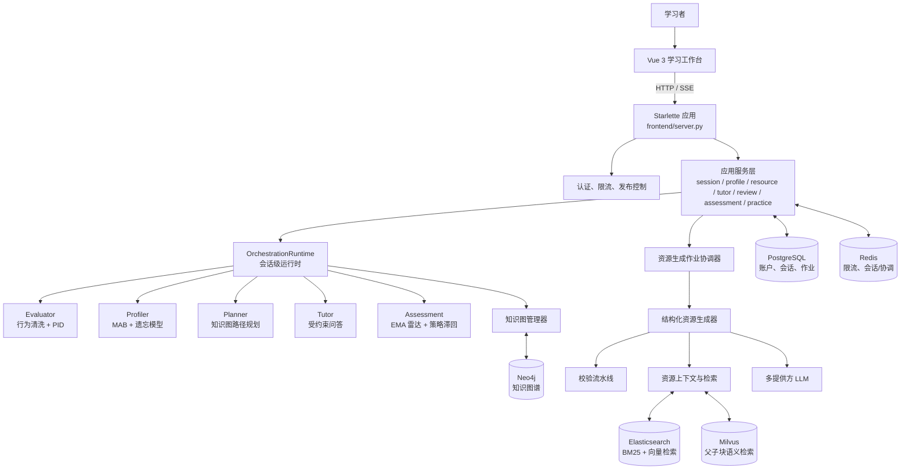
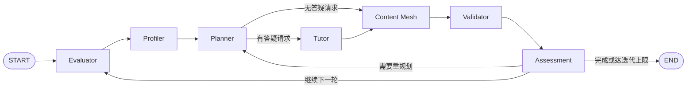
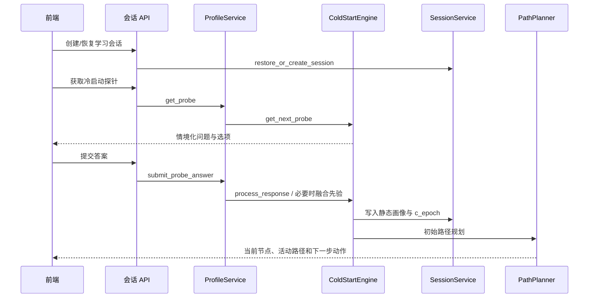
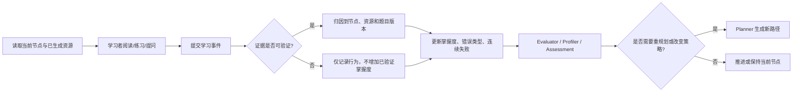
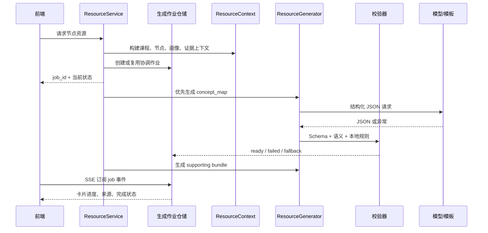
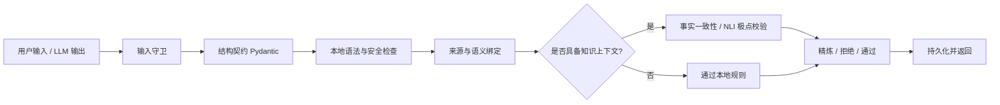

# EduAgent 项目算法、架构与技术路线说明

> 版本：v3.0  
> 更新日期：2026-07-15  
> 适用范围：EduAgent 当前仓库实现（学习会话、资源生成、辅导、评估、知识库、部署与运维）  
> 阅读对象：项目成员、评审专家、技术负责人、后端/前端/算法工程师

---

## 0. 文档结论与阅读边界

EduAgent 是一个面向数据结构与算法等结构化课程的自适应学习系统。它不将大模型视为唯一决策器，而是把学习过程拆成可验证、可持久化、可回退的控制闭环：

`学习者行为 -> 证据核验 -> 能力/画像更新 -> 知识图路径规划 -> 有依据的资源生成 -> 安全与事实校验 -> 下一轮教学策略`

系统的核心价值不是“生成一段学习内容”，而是根据学习者的证据、前置依赖、时间预算与错误模式，在正确的知识点上提供合适粒度的学习资源，并且在模型、存储或外部服务发生故障时保持可解释的降级行为。

本说明以当前代码为准，特别区分两条运行链路：

| 链路 | 当前定位 | 入口与实现 |
| --- | --- | --- |
| 正式应用链路 | Web/API 的默认路径；负责会话、资源作业、学习事件、辅导与持久化 | `frontend/server.py` -> `src.application.*` -> `src.orchestration_runtime.OrchestrationRuntime` |
| LangGraph 编排链路 | 保留的全局 Agent 编排内核与兼容能力；适用于完整节点编排、测试和演示 | `src/orchestration_core.py` 的 `EduAgentGraph` |
| 旧内部 API | 调试、测试或兼容用途，不应当被描述为新的正式业务入口 | `src/routes/new_api_routes.py` |

因此，本文不会把“所有请求均从单一 LangGraph 图直达”误写为当前事实。正式业务采用应用服务层组织事务边界与恢复策略；LangGraph 图仍是可复用的多智能体编排能力。

---

## 1. 项目目标、约束与设计原则

### 1.1 产品目标

系统服务于需要沿知识前置关系逐步掌握课程内容的学习者。一次有效学习会话应当完成以下事情：

1. 收集或恢复学习者画像，避免从“千人一面”的课程首页开始。
2. 在知识图谱上选择满足前置依赖、符合预算且与当前能力匹配的下一步路径。
3. 为当前节点生成可渲染、可追溯、可验证的学习资源，而不是无结构的自由文本。
4. 允许学习者提问、做诊断题与代码练习，并将有验证依据的结果写回学习状态。
5. 在连续失败、前置知识退化、路径漂移或错误模式稳定出现时触发干预、复习或重规划。

### 1.2 非目标

- 不把 LLM 生成的自然语言直接等同于学习事实或掌握度证据。
- 不执行生成资源中的 Python 代码来做语法验证；本地校验只使用 `ast.parse`。
- 不承诺任意外部 LLM、Neo4j、Milvus 或 Elasticsearch 在开发环境一定可用；每个外部依赖都应有明确的可用性判断与降级边界。
- 不将本地 JSON/内存回退当作生产认证数据源；生产认证和关键会话持久化应使用受控的共享后端。

### 1.3 工程原则

| 原则 | 落地方式 |
| --- | --- |
| 决策与生成分离 | 图搜索、PID、状态机、校验规则等由确定性程序执行；LLM 用于受约束的内容生成、解释与可选语义判断。 |
| 证据优先 | 学习事件、题目作答和代码运行结果通过服务层归档；无有效证据不能虚构掌握度。 |
| 契约优先 | API、会话状态、资源卡、生成作业、前端合同均由 Pydantic/前端 contract 与测试保护。 |
| 故障可见且可回退 | LLM 超时、空响应、JSON 无法解析、结构校验失败都记录来源与原因，并退回本地模板，而不是返回伪造的“成功生成”。 |
| 层间最小信任 | 前端、LLM 返回、历史资源都需要再次校验；服务端持有课程节点与资源语义绑定的最终解释权。 |
| 可运维 | 使用请求上下文日志、指标、健康/就绪探针、发布开关、并发限制和容器化部署。 |

---

## 2. 总体技术架构

### 2.1 分层视图



### 2.2 前端层

前端位于 `frontend/`，采用 Vue 3、Vite、Vue Router、Pinia 与 Axios。主要职责是学习工作台的状态呈现与交互，而不是在浏览器中自行判断学习掌握度。

| 前端能力 | 主要模块 | 技术说明 |
| --- | --- | --- |
| 路由与页面壳 | `src/router/`、`AppWorkspaceView.vue`、`workspace/WorkspaceShell.vue` | 将课程、学习、复习、设置等页面组织为可恢复的工作区。 |
| 学习资源呈现 | `ResourceCanvas.vue`、`ResourceCard.vue`、`MindMapViewer.vue` | 消费结构化资源合同，支持 Markdown、Mermaid、代码与诊断题展示。 |
| 辅导交互 | `TutorPane.vue`、`ChatArea.vue`、`useEduAgent.js` | 对接普通问答与 SSE 流式问答，展示服务端校验后的输出。 |
| 代码练习 | `CodePracticePanel.vue`、CodeMirror 依赖 | 将题目、提交、运行结果和学习事件关联到当前资源/知识点。 |
| 客户端质量 | `clientTelemetry.js`、`errorMonitoring.js`、Vitest、Playwright、axe | 记录前端错误与关键事件，并覆盖回归、异常恢复与可访问性。 |

前端不保存“真相状态”。它可以缓存 UI 状态，但会话快照、资源卡可用性、学习事件和进度由后端权威状态决定。

### 2.3 接入与 API 层

`frontend/server.py` 是 Starlette 服务入口，负责：

- 提供 API 与前端静态资源；
- 处理认证、验证码、JWT 刷新/注销、账户生命周期和课程选课；
- 将请求路由到应用服务层；
- 提供会话、冷启动、路径初始化、推进、事件、复习、练习、资源任务、辅导和运维端点；
- 用 `sse-starlette` 输出资源作业状态和辅导流；
- 在请求层执行限流、并发容量控制、请求 ID 绑定、就绪检查与发布控制。

正式学习接口以 `/api/sessions/{session_id}/...` 为中心。例如，`profile-probe` 和 `profile-input` 驱动冷启动，`path/init` 初始化路径，`events` 写入学习事件，`resources/{node_id}/generation` 创建资源任务，`tutor-stream` 提供流式辅导。

### 2.4 应用服务层

应用服务层位于 `src/application/`，它将 HTTP 请求转为有明确事务边界的用例。核心服务如下。

| 服务 | 核心职责 | 关键输出 |
| --- | --- | --- |
| `session_service.py` | 会话创建/恢复、路径初始化、推进、学习事件账本、重规划 | 当前节点、活动路径、已验证证据、下一个动作 |
| `profile_service.py` | 冷启动探针和答案提交 | 下一道探针或完成后的画像 |
| `resource_service.py` | 资源上下文、缓存、作业去重、并发、生成、回退、持久化 | `job_id`、卡片状态、资源来源/校验信息 |
| `tutor_service.py` | 辅导输入/输出校验、超时、SSE、历史资产记录 | 已校验的结构化辅导回复 |
| `assessment_service.py` | 读取能力雷达并形成评估摘要 | 雷达、薄弱项、教学策略 |
| `review_service.py` | 根据错误与到期复习项组织针对性复练 | 复习清单、重测材料 |
| `code_practice_service.py` | 绑定题目与资源、执行隔离、归档提交凭证 | 公开题目、测试摘要、可验证提交证据 |
| `learning_assets_service.py` | 会话学习资产的持久化和恢复 | 辅导记录、资源关联资产 |

这种分层使“业务用例”不依赖某个路由函数，也避免把会话写入、LLM 调用和前端序列化混在一个 Agent 节点里。

### 2.5 运行时与多智能体层

`src/orchestration_runtime.py` 的 `OrchestrationRuntime` 持有默认的 Agent 实例、课程知识图管理器、LLM 提供方序列、受限的资源生成线程池和会话级运行时对象。

一个 `RuntimeSession` 由四类数据构成：

1. `AgentState`：学习者、课程、画像、掌握度、资源、错误、反馈与当前路径的领域状态。
2. `ColdStartEngine` 与 `ColdStartState`：冷启动状态机及探针答案。
3. `PathPlanner`：由课程知识图构造的本地规划器。
4. `pipeline_log`：可用于诊断本轮服务内的处理过程。

运行时会根据环境变量建立主 LLM 和备用 LLM 顺序。每个资源调用有单次超时、总截止时间、有限重试次数和并发上限；当所有候选提供方不可用时，返回显式标记为 `template` 的本地模板，而不是把模板伪装成模型生成结果。

### 2.6 LangGraph 编排内核

`EduAgentGraph` 的逻辑图为：



图中的条件边包括：是否有 `tutor_query`、是否需要重规划、目标知识点是否达成、活动路径是否为空、以及最大迭代次数保护。它适合作为统一 Agent 逻辑的可视化与兼容编排层；正式 HTTP 流程则通过应用服务层调用其中的相应能力，以获得持久化、作业状态和可靠性控制。

---

## 3. 核心数据模型与状态流

### 3.1 `AgentState`：学习闭环的中心状态

`src/state/agent_state.py` 的 `AgentState` 是 Agent 层的共享状态协议。它至少承载以下四类信息：

| 类别 | 代表字段/对象 | 含义 |
| --- | --- | --- |
| 身份与课程 | `user_id`、`course_id`、`current_node_id`、`target_node_id` | 将所有操作绑定到特定学习者与课程上下文。 |
| 静态画像 | 认知风格 Beta 参数、时间预算、教育背景、学习动机等 | 变化缓慢，主要来自冷启动与长期反馈。 |
| 动态画像 | `knowledge_mastery`、连续失败计数、能力雷达、错误类型分布 | 随学习证据更新，用于调节难度、风格、路径与复习。 |
| 学习产物 | `active_path`、`generated_resources`、`tutor_response`、学习事件、Agent 反馈 | 让前端和后续 Agent 都能读取到可追溯的本轮结果。 |

状态更新必须经过服务边界。特别是“掌握度”不能由页面点击或大模型语句直接增加：会话服务会区分已验证的诊断题/代码提交证据与普通行为事件，确保分析层不凭空增加学习进度。

### 3.2 会话持久化与恢复

会话服务首先从存储恢复快照，若不存在则创建最小合法状态。状态写回包含会话、快照、资源卡、学习事件与必要的课程进度信息。运行时内存对象只用于降低单次调用成本，不能成为唯一状态来源。

生产部署的推荐职责分配：

| 组件 | 适合存储的数据 | 原因 |
| --- | --- | --- |
| PostgreSQL | 账户、选课、会话元数据、快照、资源生成作业、评估/事件记录 | 事务、关系约束、可查询审计。 |
| Redis | 分布式限流、验证码/令牌、并发协调、短期状态 | 低延迟、TTL、原子计数。 |
| Neo4j | 课程知识点、依赖关系、掌握关系的图查询 | 前置关系、K-hop、路径相关查询表达自然。 |
| Elasticsearch | 课程文档的全文、向量、混合检索索引 | BM25、`dense_vector`、RRF 和批量索引。 |
| Milvus | 可选的父子块语义检索与视频时间切片 | 适合高维向量近邻及父/子片段回溯。 |

开发环境可以存在 JSON 或进程内回退实现，以便本地运行；生产认证与安全相关能力要求共享、可用且受控的后端，无法满足时应失败关闭。

### 3.3 学习事件账本

学习事件不是单纯的前端埋点。它是更新画像与掌握度前的证据记录层，典型事件包括：资源完成、诊断题作答、代码练习结果、复习启动和辅导交互。

事件处理的关键约束：

1. 先定位对应会话、课程、知识点和资源卡。
2. 对需要证明的事件校验题目版本、目标节点、提交回执或测试结果。
3. 将事件与证据归因写入账本和状态。
4. 仅将可验证结果输入掌握度和错误类型更新。
5. 重复提交、错误资源绑定、过期重测结果不能绕过本轮学习证据边界。

这使得“学习进度”具备可审计性：后续评估可以说明掌握度变化来自哪一次题目、哪次代码运行或哪种行为信号。

---

## 4. 端到端学习流程

### 4.1 课程进入与冷启动



冷启动不是无限问卷。系统按六个维度收集信息：

1. 偏好认知风格：视觉、文本、实践；
2. 学习动机：考试、认证、项目、兴趣；
3. 专业背景；
4. 教育层次；
5. 每周时间预算；
6. 已有知识基础。

如果在 `c_epoch` 达到 3 轮时仍无法收齐维度，状态机进入贝叶斯先验融合，不继续消耗学习者的启动耐心。路径规划器在前 5 个冷启动 epoch 采用保守的冷启动启发式策略；这两个阈值服务于不同目标：前者是问答熔断，后者是路径策略的谨慎期。

### 4.2 正常学习、事件和推进



学习推进不要求每次请求都调用大模型。确定性算法先评估证据、掌握度和路径；只有需要资源、解释或辅导文本时才调用模型。这一选择降低延迟、成本和模型波动对教学状态的影响。

### 4.3 资源生成作业

资源生成采用“概念优先、配套资源随后”的异步作业模型：



请求会先检查缓存与现有卡片，之后由作业协调器负责去重、状态记录、并发和重试。概念图先完成，便于前端快速呈现最核心的学习骨架；代码、练习、视频摘要、诊断题随后以支持包生成。对每张卡片，持久化前都必须经过结构和语义校验。

---

## 5. 核心算法设计

## 5.1 冷启动：有限状态机与贝叶斯先验融合

### 5.1.1 状态机

实现位置：`src/infrastructure/cold_start.py`

冷启动由 `ColdStartEngine` 驱动。状态机不会依赖 LLM 自由生成问题，而是由 `ProbeFactory` 产出标准化、可解析的情境探针。每个维度有“是否采集、值、来源”等状态，保证可以断点恢复。

状态转移如下：

```text
INIT -> PROBE_* -> PROBE_* -> ... -> COMPLETE
                     |
                     | c_epoch >= 3 且仍有缺失维度
                     v
              FUSION_FALLBACK -> COMPLETE
```

### 5.1.2 缺失维度推断

当用户跳过问题、给出无效回答或达到熔断上限，系统以已获得的背景 `b`、教育层次 `e` 为条件，对待估计变量 `z`（例如认知风格或动机）计算后验：

\[
P(z\mid b,e) = \frac{P(b\mid z)P(e\mid z)P(z)}{Z}
\]

实现使用对数空间累积以避免极小概率下溢：

\[
\log \tilde P(z) = \log P(z) + \log P(b\mid z) + \log P(e\mid z)
\]

然后归一化并取 MAP 值作为缺失维度的保守初值。推断结果会携带 `inferred` 标识，应与用户主动填写的字段区分，后续真实学习反馈可以覆盖先验。

### 5.1.3 为什么采用该算法

- 比“默认把所有人设为视觉型/中等难度”更透明；
- 比无限制问卷更符合首次进入产品时的交互成本；
- 所有条件概率表可审查、可配置、可通过真实数据逐步替换；
- 先验只用于初始化，不直接作为高置信度掌握结论。

## 5.2 学习风格选择：Thompson Sampling 多臂老虎机

实现位置：`src/agents/profiler_node.py`

资源呈现风格有三条臂：`visual`、`textual` 和 `practical`。每一条臂维护 Beta 分布：

\[
\theta_s \sim \operatorname{Beta}(\alpha_s, \beta_s)
\]

每轮从每个分布抽样并选择最大值：

\[
s^* = \arg\max_{s\in\{visual,textual,practical\}}\tilde \theta_s
\]

奖励来自清洗后的有效表现 `r in [0, 1]`。当前实现以 `0.6` 为成功阈值：

\[
(\alpha_s,\beta_s) \leftarrow
\begin{cases}
(\alpha_s+r,\beta_s), & r\ge 0.6\\
(\alpha_s,\beta_s+1-r), & r<0.6
\end{cases}
\]

这里使用连续奖励而不是二元成功/失败，使高置信度的正负反馈对后验影响更大。分布期望为：

\[
\mathbb{E}[\theta_s]=\frac{\alpha_s}{\alpha_s+\beta_s}
\]

### 连续失败干预

当 `continuous_fail_counter >= 3`，系统不继续把相同风格推给学习者，而是从候选中排除刚刚投放的风格再抽样。这是一次有界的“认知切换”干预，避免推荐策略在局部最优中反复强化失败体验。

### 适用边界

该算法学习的是“特定学习者在特定资源风格下的即时有效反馈”，不是心理学意义上的固定学习类型。它应服务于探索和个性化排序，不能以此给学习者贴永久标签。

## 5.3 知识保持：Ebbinghaus 风格遗忘与记忆强度

实现位置：`src/agents/profiler_node.py`

对知识节点 `i`，当前掌握度 `m_0` 会根据距离上次有效更新的时间 `Delta t` 衰减：

\[
m_i(t)=m_{i,0}\exp(-\lambda_i\Delta t),\qquad \lambda_i=\frac{1}{S_i}
\]

其中 `S_i` 是记忆强度。当前参数将强度限制在 `[0.5, 20]`，默认值为 `10`。一次有效成功使强度乘以 `1.5`，失败使强度乘以 `0.8`：

\[
S_i \leftarrow \operatorname{clip}(S_i\times 1.5,0.5,20)\quad\text{or}\quad
S_i \leftarrow \operatorname{clip}(S_i\times 0.8,0.5,20)
\]

衰减是损失型变换：它不会为无证据的节点产生正掌握度。遗忘后的掌握度可以被重规划和复习服务消费，用于重新发现已退化的前置知识。

## 5.4 行为评估与掌握度控制：行为清洗、PID 与重规划闸门

实现位置：`src/agents/evaluator_node.py`、`src/infrastructure/pid_controller.py`

### 5.4.1 行为清洗

输入行为包含答题正确性、代码通过率、耗时比、求助次数和节点 ID 等。`BehaviorCleaner` 对越界、异常、缺失和不可靠行为进行归一化与标记，防止一次误触或极端耗时直接导致策略剧烈跳变。

清洗后的有效表现会与当前掌握度比较：

\[
g_t = p_t^{\text{effective}} - m_t
\]

- `g_t > 0`：当前证据好于既有估计，掌握度可小幅上调；
- `g_t < 0`：表现低于既有估计，应下调或触发干预；
- 更新幅度被限制，避免单次事件覆盖历史。

错误类型分布（例如逻辑错误、语法错误、边界遗漏）使用 EMA 平滑，当前平滑系数为 `0.3`，避免仅由一次偶发错误决定教学策略。

### 5.4.2 PID 控制器

系统将“目标掌握度”和“实际掌握度/表现差距”视为控制问题。基础 PID 形式为：

\[
e(t)=r(t)-y(t)
\]

\[
u(t)=K_p e(t)+K_i\int e(t)dt+K_d\frac{de(t)}{dt}
\]

在本项目中，`u(t)` 不直接替代成绩，而作为难度系数、资源粒度和干预强度的受限控制量。实现中包含以下工程化处理：

| 机制 | 处理方式 | 目的 |
| --- | --- | --- |
| 输出限幅 | 将控制输出夹在配置的上下界内 | 防止难度或干预超出可解释范围。 |
| 条件积分 | 当误差绝对值过大时暂缓积分累积 | 防止大偏差期积分“充电”造成超调。 |
| Back-calculation anti-windup | 输出饱和后反算削减积分项 | 防止长期饱和后恢复缓慢。 |
| 测量微分 + 低通滤波 | 对测量值微分而非设定值微分 | 减少设定点突变导致的微分冲击和噪声放大。 |
| 自适应增益 | 连续失败达到阈值后提高 `Kp`/`Ki`，`Kd` 保守 | 加快持续低表现下的纠偏，同时避免对噪声过敏。 |

连续失败计数在低表现时递增、在稳定正表现时逐步回落。掌握度单次增减会被夹在安全范围内，最终仍受服务层的已验证学习证据边界约束。

### 5.4.3 PID 重规划闸门

直接根据单点低分重规划会造成路径抖动。`PIDReplanGate` 观察目标误差趋势：只有误差持续恶化、停滞达到窗口阈值或达到连续失败条件时，才将结果标记为需要重规划。这样把“控制量波动”与“路径改变”解耦：前者可以先通过降低难度、变更资源风格解决，后者只在问题持续时发生。

## 5.5 知识图谱与路径规划：DAG、拓扑序和带约束最短路

实现位置：`src/infrastructure/path_planner.py`、`src/agents/planner_node.py`、`src/graph/`

### 5.5.1 图模型

知识点是带属性节点：

```text
KnowledgeNode(node_id, title, difficulty, estimated_hours, category)
```

前置关系是有向边：

```text
KnowledgeEdge(source_id -> target_id, dependency_type, weight)
```

依赖类型可表达严格、推荐或可选关系。方向统一为“前置知识 -> 后续知识”，因此一个合法学习路径必须满足拓扑顺序。

### 5.5.2 图质量治理

在导入知识图时，`GraphBuilder` 依次执行：

1. 构建邻接表；
2. 运行 Tarjan 强连通分量算法检测环；
3. 根据策略移除环内最弱边、移除环内全部边或直接报错；
4. 在 DAG 上执行传递约简，删除可由更长路径推导的冗余直接边；
5. 写入 Neo4j，并再次验证最终图是否为 DAG。

Tarjan 的时间复杂度为 `O(V + E)`。传递约简的当前实现更适合中等规模知识图；当课程规模大幅增长时，应切换到位集加速或离线图构建任务，避免在在线请求中做重计算。

### 5.5.3 路径代价与求解

规划器先用 Kahn 算法计算拓扑序并校验无环，然后裁剪已掌握节点、确定源点和目标点，最后在 DAG 上运行单源最短路。Agent 规划器中的边代价可概括为：

\[
\operatorname{cost}(u,v)=(1-m_u)\cdot w_{uv}+d_v
\]

其中：

- `m_u` 是前置节点掌握度，未掌握越多，跨越该依赖的代价越高；
- `w_uv` 是依赖权重；
- `d_v` 是后继知识点难度。

系统提供最小权重、最少跳数、平衡策略和冷启动启发式等权重函数。由于知识图是 DAG，可以按拓扑序松弛得到 `O(V+E)` 的理论复杂度；Agent 内部求解器也提供最小堆导向的实现与路径细节输出，便于诊断每条边的代价来源。

### 5.5.4 约束与重规划

路径不是无约束地追求最远节点。规划结果还要经过：

- 已掌握节点剪枝；
- 最大路径长度限制；
- 每周时间预算的贪心截断；
- 逐边合法性验证；
- 不可达节点诊断。

以下情况会触发或建议触发重规划：

1. 当前节点不再位于活动路径中，发生路径漂移；
2. 当前路径前置节点的掌握度低于阈值；
3. PID 重规划闸门判定低表现具有持续性；
4. 用户主动请求重规划；
5. 冷启动完成后，先验画像被真实行为显著修正。

## 5.6 能力评估：EMA 五维雷达与滞回策略控制

实现位置：`src/agents/assessment_node.py`

能力雷达包含五维：概念理解、代码工程、逻辑推理、错误抗挫和时间管理。对第 `i` 维，更新公式为：

\[
R_i^{(t)}=\alpha s_i^{(t)}+(1-\alpha)R_i^{(t-1)}
\]

当前默认 `alpha=0.2`。综合得分为五维均值：

\[
A_{mix}=\frac{1}{5}\sum_{i=1}^{5}R_i
\]

策略控制器采用滞回而不是单阈值切换：

| 条件 | 结果 |
| --- | --- |
| `A_mix < 0.40` 且连续失败至少 2 次 | 切换为 `SCAFFOLD_HELP`，增加支架式引导。 |
| 当前为支架或边界专项，且 `A_mix > 0.75` | 回到 `STANDARD_PATH`。 |
| 标准路径下最近 3 次边界遗漏 EMA 均大于 `0.5` | 切换为 `EDGE_CASE_DRILL`。 |

上下阈值不同能减少策略在临界区来回抖动。评估报告可由 LLM 增强，但雷达数值和策略选择本身由确定性算法决定。

---

## 6. 知识库、检索与事实依据

### 6.1 文档摄取与切分

项目提供两套互补的文档处理能力：

| 组件 | 作用 |
| --- | --- |
| `DocumentIngestionPipeline` / `SemanticChunker` | 面向文档版面、Markdown 结构和语义边界的通用切分。 |
| `MarkdownKnowledgeBaseChunker` | 面向密集教育 Markdown 的标题感知切分，适合 Elasticsearch 索引。 |
| Milvus 父子块模型 | 以父块保留上下文、子块提高召回粒度；检索后可回溯父上下文。 |

摄取时应给每个块写入稳定的 `document_id`、来源路径、章节层级、节点/课程元数据和引用 ID。资源生成时，引用 ID 是后续校验的硬约束，而不是仅供展示的附加信息。

### 6.2 Elasticsearch 混合检索

实现位置：`src/vector/elasticsearch_knowledge_base.py`

Elasticsearch 知识库结合：

- BM25：保证关键术语、定义、公式和章节标题的精确命中；
- `dense_vector` KNN：召回语义近似但词面不同的教材段落；
- Reciprocal Rank Fusion（RRF）：融合两类排序结果。

RRF 分数为：

\[
\operatorname{RRF}(d)=\sum_{l\in L}\frac{1}{k+\operatorname{rank}_l(d)}
\]

当前默认的 `rank_constant` 为 `60`。系统优先尝试 Elasticsearch 原生 RRF；若集群许可或能力不支持，则分别取 BM25 与 KNN 结果，在客户端做相同的 RRF 融合。若向量检索不可用，还可以退回受限的 BM25 路径，保持知识库调用可用而不假称为混合召回。

### 6.3 资源上下文（RAG Context）

`build_resource_context` 会形成受控的 `ResourceContext`，至少包含：课程 ID、节点 ID/标题、前置节点、掌握度桶、推荐风格、错误签名、可信来源引用、知识库证据引用及 locale。LLM 不应仅收到一个主题字符串；它必须在明确的节点和来源约束下生成资源。

这样做解决三个问题：

1. 同一主题词在不同课程/节点下的含义混淆；
2. 生成内容跳过当前节点的前置关系；
3. 难以证明资源使用了系统提供的可信知识依据。

---

## 7. 结构化资源生成与质量保障

### 7.1 五类资源卡

实现位置：`src/resource_generation/schemas.py`

Markdown 是渲染结果，不是资源真相。每张卡先遵循 Pydantic 数据契约，再被渲染为 Markdown。当前资源合同版本为 `resource-v3`。

| 类型 | 主要字段与教学作用 |
| --- | --- |
| `concept_map` | 定义、约束、机制、前置、误区、反例、迁移问题、复习提示和 Mermaid 图；用于优先建立概念骨架。 |
| `code_snippet` | 仅允许 Python，包含场景、代码、边界测试、推演、复杂度与常见陷阱；确保可做本地语法检查。 |
| `interactive_exercise` | 目标、错误签名、步骤、检查点、提示和解题纲要；用于针对错误模式练习。 |
| `video_summary` | 时间线、观看重点、复习问题及受信任视频来源；外部链接必须可追溯。 |
| `diagnostic_quiz` | 至少覆盖概念、理解、应用三个层次；每题四个不重复选项，附答案、解释、技能和错误标签。 |

### 7.2 模型调用与降级

`ResourceGenerator` 向模型请求 JSON 模式的结构化输出，随后执行解析、绑定、校验和渲染。典型异常处理如下：

| 异常 | 处理 |
| --- | --- |
| 无可用凭证/提供方 | 生成本地模板，来源为 `template`。 |
| 调用超时或错误 | 在总截止时间内按配置尝试候选提供方；失败则模板回退。 |
| 返回为空或无合法 JSON | 标记原因，例如 `empty_response` 或 `invalid_json`，模板回退。 |
| Pydantic Schema 不通过 | 不持久化原始响应，使用本地合规模板。 |
| 语义/引用校验失败 | 拒绝或修复，不将不合格资源暴露为可用卡片。 |

作业和卡片元数据保存 `source`、provider、model、attempt_count、elapsed_ms、fallback_reason 等来源信息。前端和运维侧因此可以区分“高质量模型生成”“模型回退模板”“生成失败”，不会把可用性问题伪装成内容质量问题。

### 7.3 多层校验

资源与辅导输出需要通过以下防线：



具体规则包括：

1. **输入守卫**：限制提示词最大长度（当前 8000 字符）、payload 最大嵌套深度（当前 8），并检测提示词注入模式后进行拒绝或净化。
2. **Schema**：每种资源的字段类型、长度、枚举、选项数和数值范围均受 Pydantic 限制。
3. **本地结构极点（Pole 1）**：检查代码 AST、公式语法、Mermaid 起始形式等。Python 只用 `ast.parse`，不执行模型代码。
4. **来源引用**：每张资源至少要引用一个 `source_ref_id`；当上下文要求知识库依据时，必须引用提供的 grounding reference。
5. **视频可信性**：视频 URL 必须来自上下文的可信视频索引，并且 `video_source_id` 必须匹配。
6. **服务端语义绑定**：资源元数据携带由服务器确定的课程、节点和标题；资源正文开头范围内必须能识别该规范标题，防止“给任意 node_id 贴标签”的离题内容入库。
7. **事实极点（Pole 2）**：存在 ground-truth context 时，对输出分块做事实一致性/蕴含检查；可安全精炼则返回精炼文本，不能保证则拒绝。
8. **内容安全**：先通过内容过滤器；可净化的内容按规则精炼，否则返回拒绝状态。

### 7.4 为什么不只依赖“提示词要求模型正确”

提示词只能影响概率，不能构成系统约束。此项目把“节点绑定、引用、代码语法、外部视频来源、结构字段、输出安全”交给可测试的规则和契约；LLM 仅在其擅长的解释与表达环节发挥作用。这是教育产品可审计性和稳定性的重要基础。

---

## 8. 智能辅导、代码练习与复习闭环

### 8.1 辅导 Agent

实现位置：`src/application/tutor_service.py`、`src/agents/tutor_node.py`

辅导请求先被统一为 `TutorRequest`，经过输入校验，再交给 `TutorAgentNode`。服务层为普通和流式请求分别设置全局/单用户容量限制，防止单个用户占满模型连接。

流式辅导使用 SSE。若模型没有配置、流式调用异常、超时或结构化响应无法解析，服务会回退到本地/普通辅导结果，并在流中发送相应的重置或告警事件。最终写入会话的回复仍要经过输出校验；不合格文本将被阻断并替换为安全的提示，而不是直接回显模型原文。

### 8.2 代码练习

代码练习服务将问题绑定到课程节点和资源卡，公开题目与测试摘要，接收提交并生成可核验的回执。该回执可被学习事件服务引用，从而使“代码能力提升”有来自运行结果的证据，而不仅是用户自行声明已完成。

隔离执行器的职责是将用户代码执行与主应用隔离。生产环境应继续强化：资源限制、网络禁用、只读文件系统、执行超时、输出截断和镜像白名单都应作为不可跳过的部署约束。

### 8.3 复习与错误驱动再练

复习服务从状态中的诊断题结果、错误类型、代码提交和资源信息构建复习项目。它能够给出针对性的材料，而不是简单重复原章节：

- 概念薄弱：回到概念图、定义、约束和反例；
- 边界遗漏：进入边界专项策略与边界测试；
- 代码失败：绑定新的可验证练习，避免用旧的已消费题目直接“刷通过”；
- 前置退化：将问题反馈给路径规划器，补齐依赖后再回到当前目标。

---

## 9. LLM 接入策略

### 9.1 多提供方与超时控制

运行时支持按环境变量配置主提供方和备用顺序。当前凭证检查覆盖 DashScope/Qwen、DeepSeek、OpenAI 和 Spark 等提供方；提供方别名在运行时归一化。对于资源生成：

- 单次尝试超时由 `EDUAGENT_RESOURCE_LLM_TIMEOUT_SEC` 控制；
- 一次资源任务有总截止时间 `EDUAGENT_RESOURCE_LLM_TOTAL_TIMEOUT_SEC`；
- 重试次数、退避和并发度均可配置；
- 批量资源共享绝对截止时间，避免队列波次将延迟放大为多倍超时；
- 所有失败路径都落入可追溯模板，而不是无限重试。

### 9.2 提示词与结构输出

资源提示词位于 `src/resource_generation/prompts.py`，以卡片类型、上下文、允许的来源引用和 JSON Schema 为核心约束。辅导/评估提示词通过 Prompt Registry 和 Adapter 层集中管理，避免不同 Agent 在各自文件中复制、漂移的系统提示词。

设计要求是：

1. 将节点、前置、错误签名和可信证据作为输入事实；
2. 明确输出的 JSON 形状和字段上限；
3. 不允许模型自行编造来源 ID、视频链接或未提供的课程节点；
4. 将模型响应视为“不可信外部输入”，无论模型来自何种厂商。

---

## 10. 安全、可靠性与可观测性

### 10.1 安全边界

| 层面 | 当前机制 |
| --- | --- |
| 账号与身份 | Argon2 密码哈希、JWT、刷新令牌、会话撤销、验证码、邮箱动作令牌。 |
| 请求防护 | 限流、按用户并发限制、认证边界、生产环境持久化后端可用性检查。 |
| 提示词安全 | `PromptDefense` 与 `InputGuard` 检测注入、限制长度和 payload 深度。 |
| 内容安全 | 输出内容过滤、净化、拒绝和结构校验。 |
| 资源安全 | 模型代码不在校验路径执行；代码练习应在隔离运行器执行。 |
| 部署安全 | Docker 镜像以非 root 用户运行、只读根文件系统、丢弃 capabilities、`no-new-privileges`、仅本机绑定数据库端口、Nginx 对外代理。 |

### 10.2 可靠性模式

| 失败类型 | 对策 |
| --- | --- |
| LLM 不可用/超时 | 候选提供方、有限重试、全局 deadline、本地模板和来源标记。 |
| 生成结构错误 | JSON 提取失败后回退；Schema 不通过不入库。 |
| 资源离题 | 服务端课程/节点/标题绑定检查，失败即拒绝。 |
| 知识库不可用 | 检索层可退至有限路径；资源上下文明确标示可用来源。 |
| 临时并发过高 | 生成 worker、全局槽位和单用户容量限制。 |
| 重复/并发资源请求 | 作业协调仓储和卡片状态机避免重复工作与竞态持久化。 |
| 旧资源不满足新合同 | 兼容读取路径可修复或生成合规模板，避免直接暴露失效卡片。 |

### 10.3 可观测性与发布控制

`src/observability.py` 提供结构化日志、请求上下文、计数指标和耗时观测。系统至少应监控：

- API 延迟、错误率、就绪状态；
- LLM 调用时延、超时、失败、备用提供方命中和模板回退比例；
- 资源作业排队时间、完成率、卡片校验拒绝原因；
- 辅导阻断率、流式回退率、容量拒绝率；
- 学习事件验证失败率、重规划触发率、复习完成率；
- Redis、数据库、Neo4j、ES、Milvus 可用性。

`src/release_controls.py` 与环境变量支持滚动发布、白名单、拒绝名单和百分比开关，例如代码练习、应用访问和资源生成均可单独灰度。新算法或新模型必须先经过可观测的灰度，而不是直接覆盖全量学习者。

---

## 11. 测试与质量策略

测试目录覆盖多个风险层级：

| 测试层 | 代表范围 |
| --- | --- |
| 算法单测 | PID、路径规划、冷启动、Profiler、Evaluator、文档切分、图构建。 |
| 合同测试 | 资源合同、会话响应、兼容 API、前端可见控制、部署契约。 |
| 应用服务测试 | 会话边界、学习事件真实性、资源生成可靠性/恢复/缓存、辅导安全回退。 |
| 持久化测试 | 会话恢复、快照、资源作业协调、状态审计。 |
| 安全测试 | 认证、账户生命周期、输入/输出守卫、速率限制和安全边界。 |
| 前端测试 | Vitest 组件/组合式函数测试、Playwright 端到端流程、异常恢复与无障碍检查。 |
| 发布冒烟 | `scripts/release_smoke.py`、健康/就绪检查和部署契约。 |

建议将质量门禁分为两级：

1. **PR 门禁**：Python 单测、前端 lint/typecheck/unit、资源合同、关键 API 契约；
2. **发布门禁**：容器启动、数据库/Redis/ES/Neo4j 就绪、真实或受控 LLM 冒烟、资源作业 SSE、登录与会话主流程、回退路径验证。

---

## 12. 部署架构与运行建议

### 12.1 容器编排

`docker-compose.yml` 提供的生产型组合包括：

- 应用服务；
- PostgreSQL 16；
- Redis 7；
- Neo4j 5；
- Elasticsearch 8；
- Milvus 2.3 及其 etcd/MinIO 依赖；
- Nginx 反向代理配置。

外部端口默认绑定在 `127.0.0.1`，由 Nginx 统一处理公网入口。应用容器配置为非 root、只读文件系统、`tmpfs` 临时目录、capability drop 和 `no-new-privileges`。这不是替代网络分段、密钥管理和备份策略，而是基础运行时防护。

### 12.2 环境配置原则

必须通过 `.env`/密钥管理系统提供：`PUBLIC_APP_URL`、JWT 密钥、运维 token、数据库/Redis/Neo4j 凭证、LLM 密钥、对象存储或向量库凭证等。仓库中的 `.env.example` 仅作为字段说明，不能部署真实密钥。

关键配置建议分组管理：

| 组 | 示例 |
| --- | --- |
| 可用性 | LLM timeout、总 deadline、worker 数、作业 stale 时间、资源并发度。 |
| 安全 | JWT、Redis/数据库密码、可信代理、验证码、会话撤销。 |
| 发布 | rollout percent、allowlist、denylist、功能开关。 |
| 存储 | PostgreSQL、Redis、Neo4j、ES、Milvus 连接字符串。 |
| 观测 | 日志级别、Sentry DSN、环境和 release 标识。 |

---

## 13. 技术路线

以下路线以“先保证事实、会话和资源可靠，再提高智能性和规模”为原则。前四项是当前代码已具备的基础，后续阶段是建议的工程演进，不应误写为现有已完成能力。

### 阶段 A：当前已实现的基础能力

| 能力域 | 已具备基础 |
| --- | --- |
| 学习闭环 | 会话、冷启动、路径初始化、学习事件、推进、重规划、复习。 |
| 自适应算法 | 贝叶斯冷启动、Thompson Sampling、遗忘衰减、PID 调节、DAG 路径与 EMA 策略。 |
| 资源可靠性 | 结构化五卡、概念优先作业、来源标记、模板回退、Pydantic/语义校验。 |
| 知识基础设施 | Neo4j 知识图、Elasticsearch 混合检索、Milvus 父子块能力、文档切分与导入脚本。 |
| 产品与工程 | Vue 工作台、SSE、认证、限流、容器化、监控、灰度控制和多层测试。 |

### 阶段 B：0-4 周，巩固正确性与可观测性

目标：将“能用的自适应”变成“可证明、可回放、可调参的自适应”。

1. 为每个掌握度变化写入统一的证据 ID、算法版本、参数快照和因果说明。
2. 将资源作业的状态转换、幂等键、重试和 stale-job 回收指标集中到运维面板。
3. 为 LLM/模板来源、校验拒绝和事实精炼建立质量看板，并按课程节点钻取。
4. 将策略切换、路径重规划、风格探索的原因输出为前端可读的“推荐依据”。
5. 对生产回退路径进行定期演练：无 LLM、无 ES、无 Redis、慢模型、重复请求、恢复旧会话。

验收指标建议：资源作业完成率、模板回退率、校验拒绝率、P95 首张概念卡时延、会话恢复成功率、学习事件证据完整率。

### 阶段 C：1-2 个迭代，提升检索与内容可信度

目标：从“上下文可用”提升到“证据覆盖可衡量”。

1. 为每个知识库块增加课程版本、知识点、难度、发布日期和失效状态。
2. 评估 BM25、向量、RRF 在不同问题类型（定义、代码、边界、迁移）的 Recall@K、nDCG 和引用覆盖率。
3. 对资源内容建立句子级或段落级 evidence-to-claim 映射，而非仅卡片级 `source_ref_ids`。
4. 把检索、重排、生成、校验四个阶段的延迟和命中质量分开统计。
5. 对课程变更引入索引版本和回滚，避免旧引用与新课程节点错配。

### 阶段 D：2-3 个迭代，算法校准与实验平台

目标：让策略参数由真实学习效果校准，而不是长期依赖固定经验值。

1. 对 Thompson Sampling 的奖励定义做离线回放，比较正确率、完成率、复习后保持率等不同组合。
2. 对 PID 的 `Kp/Ki/Kd`、失败阈值、掌握度上限和 EMA 系数建立版本化实验配置。
3. 使用策略级 A/B 或 bandit 实验比较标准路径、支架教学、边界专项的短期与延迟收益。
4. 为冷启动先验引入置信度和用户显式纠正入口，逐步用匿名聚合数据校准条件概率表。
5. 定义“路径效果”指标：目标达成率、前置返工率、单位有效学习时间、重规划后恢复率。

实验必须保留保守基线和一键回滚，且不得以未验证的模型文字直接修改高风险学习状态。

### 阶段 E：规模化与平台化

目标：支持多课程、多租户、更多资源和更高并发。

1. 将进程内资源 worker 演进为独立任务队列/worker 服务，并以 Redis/数据库实现跨实例协调。
2. 为向量检索、知识图查询和资源缓存建立容量模型、分片与冷热数据策略。
3. 将课程导入、图构建、切片、嵌入、索引和质量检查做成可追溯的离线管道。
4. 将模型网关独立为统一服务，负责多提供方路由、限额、缓存、审计和 Prompt 版本。
5. 通过 OpenTelemetry 或等价标准贯通浏览器、API、作业、数据库和模型调用链路。

### 阶段 F：长期智能化方向

在基础数据质量得到保证后，可以探索：

- 基于知识追踪（BKT/DKT/Transformer KT）的长期掌握度估计，与现有 PID/EMA 进行并行评估；
- 基于约束优化的多目标路径规划，同时优化掌握提升、时间、兴趣、难度波动和复习债务；
- 多模态资源质量评估，但仍以受控来源和可验证结构为前提；
- 教师/课程运营控制台，用于审核知识图、来源、算法配置和异常学习样本；
- 隐私保护的数据分析、最小化采集、可导出和可删除的学习数据治理。

---

## 14. 关键风险与决策记录

| 风险 | 可能后果 | 已有缓解 | 后续建议 |
| --- | --- | --- | --- |
| LLM 幻觉或离题 | 错误教学内容进入学习路径 | 结构约束、来源、语义绑定、双极点校验、模板回退 | 做 claim-evidence 追溯与人工抽检闭环。 |
| 单次行为噪声 | 难度/路径频繁抖动 | 清洗、EMA、PID 限幅、重规划闸门 | 离线回放调参，按课程校准阈值。 |
| 冷启动信息不足 | 初始路径不准 | 三轮熔断与贝叶斯先验 | 提供用户纠正和置信度展示。 |
| 图谱有环或冗余 | 路径算法失效或不透明 | Tarjan、消环、传递约简、DAG 验证 | 图谱变更走 CI 校验和人工审核。 |
| 外部依赖不可用 | 白屏、长时间等待或错误状态 | 超时、回退、就绪检查、模板、可选存储 | 定期故障演练和容量压测。 |
| 资源与节点错配 | 学习者收到相关但错误的内容 | 服务端语义绑定 | 对标题别名/多语言建立受控词表。 |
| 生成代码风险 | 代码执行影响主系统 | AST 仅解析、隔离执行器 | 强制容器/沙箱资源限制与审计。 |
| 本地回退误用于生产 | 认证/数据丢失/不一致 | 生产环境对关键存储失败关闭 | 在部署检查中禁止不安全 fallback。 |

---

## 15. 代码导航

| 主题 | 主要文件 |
| --- | --- |
| 应用入口与正式路由 | `frontend/server.py` |
| 会话运行时 | `src/orchestration_runtime.py` |
| LangGraph 编排内核 | `src/orchestration_core.py` |
| 学习状态与领域模型 | `src/state/agent_state.py`、`src/domain/` |
| 会话/事件/重规划 | `src/application/session_service.py` |
| 资源作业与卡片持久化 | `src/application/resource_service.py` |
| 资源上下文、生成、契约、校验 | `src/resource_generation/` |
| 冷启动、PID、图构建、路径规划 | `src/infrastructure/` |
| 画像、评估、路径、辅导、验证 Agent | `src/agents/` |
| 知识图、向量检索、ES 知识库 | `src/graph/`、`src/vector/` |
| 输入/输出验证 | `src/validation/` |
| 认证、限流、提示词防护 | `src/auth/` |
| 数据库和缓存仓储 | `src/database/` |
| 部署与反向代理 | `Dockerfile`、`docker-compose.yml`、`nginx/` |
| 测试与发布冒烟 | `tests/`、`frontend/tests/`、`scripts/release_smoke.py` |

---

## 16. 总结

EduAgent 的技术路线建立在一个明确的分工上：大模型负责受上下文和契约约束的解释与内容生成；确定性算法负责冷启动、风格探索、遗忘、控制、路径、评估与状态转移；应用服务与仓储负责证据、持久化、并发、回退和审计。

这使项目具备从单课程智能学习工作台演进为多课程自适应教育平台的基础。后续工作应优先提高证据质量、检索可追溯性、算法参数校准和生产级运行保障，再扩展更复杂的模型与自动化能力。
